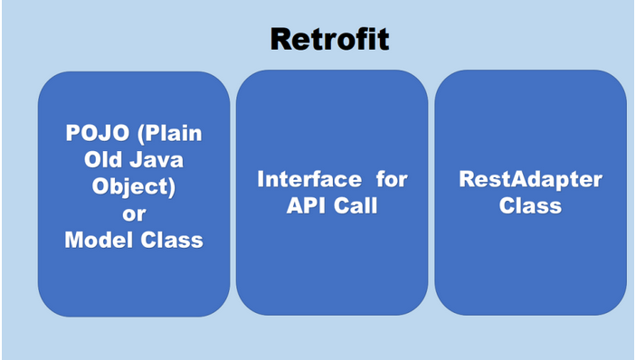
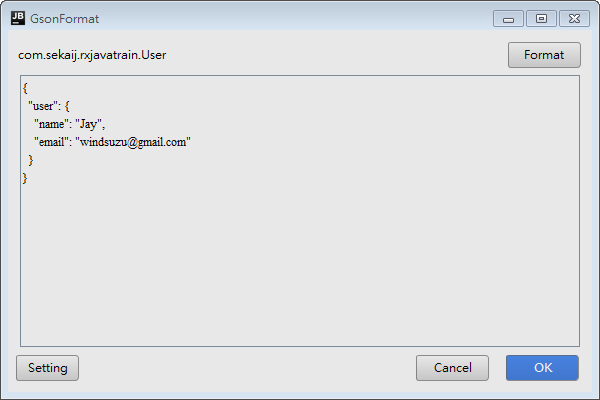

Retrofit 是什麼 ? 我也是學習 RxJava 途中才知道， Retrofit 跟 Volley 一樣是 Android 一種 HTTP 請求的框架，但實際操作了一遍，感覺比 Volley 還要更簡便，而且能夠支援 RxJava 的關係，必須要學習一下。

> 好文參考
[【Android】Retrofit 2.0 的使用](http://www.jianshu.com/p/7efdc3477269)
[Android Retrofit 2.0使用](http://wuxiaolong.me/2016/01/15/retrofit/)
[你真的会用Retrofit2吗?Retrofit2完全教程](http://www.jianshu.com/p/308f3c54abdd)
[Retrofit2源碼解析](http://bxbxbai.github.io/2015/12/13/retrofit2/)


## Retrofit 2 介紹

上面說到 Retrofit 2 為一種 HTTP 請求的工具，並且使用 REST API 設計，由 RESTful Client 向 Server 發出請求。
> 有關 RESTful API 的相關文章
[RESTful API 设计指南](http://www.ruanyifeng.com/blog/2014/05/restful_api.html)
[定義 1 - 什麼是 REST/RESTful ?](http://ithelp.ithome.com.tw/articles/10157431)



1. 創建一個能裝載數據的 Class (Model or POJO)，
2. 創建 Interface 來管理各種 HTTP APIs
3. 最後創建 REST Client 發出請求，等待回傳 JSON 數據，使用內建的 Gson 解析序列

---

## Retrofit 2 基本的用法

### Setup
* Gradle 配置
``` xml
compile 'com.squareup.retrofit2:retrofit:2.2.0'
compile 'com.squareup.retrofit2:converter-gson:2.2.0'
```

* 別忘了到 manifest 新增網路的權限
``` xml
<uses-permission android:name="android.permission.INTERNET"/>
```

---

### 創建裝載數據 Class

這邊可以使用 Android Studio 的插件 GsonFormat ，輕鬆將 JSON 轉換為 JavaBean 類別。

安裝方法 -> Settings -> Plugins -> Browse Repositories -> 搜尋 GsonFormat -> restart

新增空白的 Class 後 Alt + Insert




就能夠直接產生一個 JavaBean 的類別 !
``` java
public class User {

    private String name;
    private String email;

    public String getName() {
        return name;
    }

    public void setName(String name) {
        this.name = name;
    }

    public String getEmail() {
        return email;
    }

    public void setEmail(String email) {
        this.email = email;
    }
}
```


---

### 創建 Retrofit 物件與實作 Interface 
假設今天要到 `http://www.api.com/user/{userid}` 取得 user 的資料。

``` java
Retrofit retrofit = new Retrofit.Builder()
            .addConverterFactory(GsonConverterFactory.create()) // 使用 Gson 解析
            .baseUrl("http://www.api.com/")
            .build();


public interface ApiService {
  // 會返回一個 call 類別
  @GET("user/{userid}")
  Call<User> getUser(@Path("userid") String userid);
}
```

### 創建要去請求 API 的 Client Service
* 創建
``` java
Api apiService = retrofit.create(ApiService.class);
Call<User> call = apiService.getUser("123");
```

* 發出請求 (同步)
``` java
User user = call.execute();
```


* 發出請求 (異步)
``` java
call.enqueue(new Callback<User>(){  
         @Override  
         public void onResponse(Response<User> response) {  
             //成功後，使用 response.body() 得到結果
             User user = response.body();
          }  
          @Override  
          public voidonFailure(Throwable t) {  
             // 請求失敗
         }  
     });
```

---

## HTTP API 不同的請求方法 
以下來自官方的文檔，作為記憶之用，請參考 [Retrofit Documentation](http://square.github.io/retrofit/)

> 另外可以參考
[Retrofit · Android third-party 使用心得](https://bng86.gitbooks.io/android-third-party-/content/retrofit.html)
[Retrofit使用教程(二) | DevWiki Blog](http://www.devwiki.net/2016/03/19/Retrofit-Use-Course-2/)


### GET METHOD
* 假設要讀取用戶列表，不用用到任何參數
``` java
@GET("users/list")
Call<List<User>> getUsers();
```

* 可以帶入 query
``` java
@GET("users/list?sort=desc")
```

* URL 帶入參數
``` java
@GET("group/{id}/users")
Call<List<User>> groupList(@Path("id") int groupId);
```

* 若要邊帶入 URL 參數並且 query
``` java
@GET("group/{id}/users")
Call<List<User>> groupList(@Path("id") int groupId, @Query("sort") String sort);
```

### POST METHOD

* 假設要更新使用者資料，需要使用 `form-encoded` 
``` java
@FormUrlEncoded
@POST("user/edit")
Call<User> updateUser(@Field("first_name") String first, @Field("last_name") String last);
```

* 需要利用 `multipart` 上傳文件
``` java
@Multipart
@PUT("user/photo")
Call<User> updateUser(@Part("photo") RequestBody photo, @Part("description") RequestBody description);
```

---

使用過 Retrofit 的確比 Volley 的用法更簡潔方便了，再來就要試試怎麼樣引入 RxJava 當中。多多實作再來了解其中的運作原理吧 !


