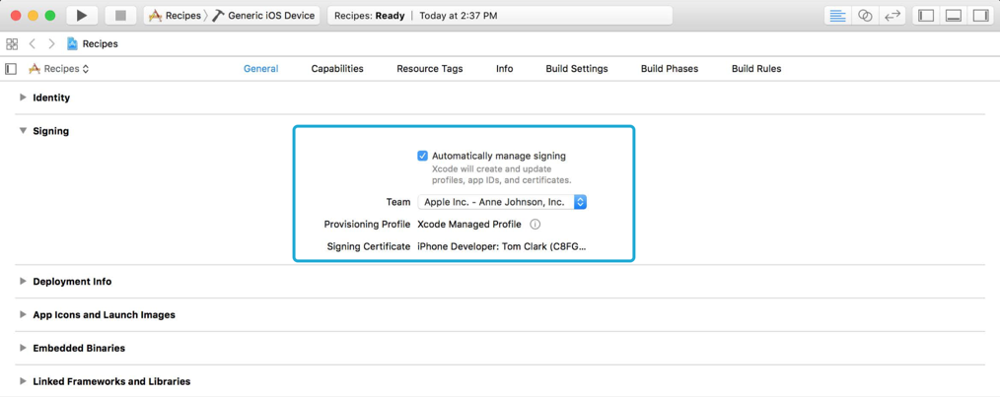

第一次要挑戰將 App 上架到 App Store，可是卻發現更新到 Xcode 8 之後，Xcode 預設進行了 Automatically Manage Signing 的動作，自動生成了 App ID 、 Certificate 、 provisioning profiles 。在還沒搞懂 Apple 上架流程的情況，網路上又找不太到相關的教學，搞得頭昏眼花... 最後還是回到 Apple developer Website 將 App 建立相關的文件，勉強成功上傳到 itunes connect  (┛`д´)┛

所以回過頭來，趕快在被 Apple 拒絕退件前，好好學習一下上架相關的 workflow 與 certificate、profiles 等文件之間的關係。

## 註冊 Apple ID & 開發者帳號 iOS Developer Program

> 好文參考
[iOS App 上架流程, (1/3) 申請 Apple ID for Company - 大兵萊恩 一路直前](http://gogoprivateryan.blogspot.tw/2015/08/ios-app-13-apple-id-for-company.html)
[[iOS] Apple iOS Developer Program 開發者帳號 申請實錄 @ 清新下午茶](http://j796160836.pixnet.net/blog/post/32377597)

不需要多說，就是照著網路上的教學，一步一步的走就可以成功註冊。

## 簽署憑證之間的關係

> 好文參考
[[iOS] App 上架憑證流程筆記](http://andyyou.logdown.com/posts/216618-ios-app-shelves-certificate-process-notes)

在了解整個上架流程之前，必須先來研究一下什麼是 CSR (Certificate Signing Request) 、Certificate，什麼又是 Provisioning Profiles 、 Entitlement 。

### ** Certificate Signing Request ** 

在向 Apple 申請 Certificate 之前需要在 Mac 上產生 .csr 檔案。 有人翻譯成憑證簽發請求文件，簡稱憑證請求檔，裡面包含了這台 Mac 的一些資訊，以此驗證這台 Mac 身分。並產生成一個私密金鑰 (Private Key)，與一個 .csr 檔案 (公開金鑰) 交付給 Apple。

### ** Certificate ** 
有了我們 Mac 的 .csr 檔案後， Apple 作為憑證頒發機構，就可以以他的私鑰簽名在我們的 .csr 檔案， 也就是頒發給我們的證書。用意即 Apple 認證這台電腦是合法的開發者在使用的。
- For Developement
讓我們能夠部暑 App 到裝置上進行測試。
- For Production
用來發佈到 App Store 或進行特殊用途如 TestFlight 。

### ** App ID **
App ID 就是 APP 唯一的識別名稱，必須要和Xcode裡面的 bundle ID 一樣。
- Explicit App ID
如果 App 有 In-App Purchase 等 Service 功能， App ID 必須是唯一的。比如說 com.apple.MyApp 。
- Wildcard App ID
可以利用像 com.apple.* 含 * 的 ID ， 建立通用的 App ID 給多個 App 使用。

### ** Entitlement ** 
管理一些 Service 的 Capabilities ， 比如 In-App Purchase，Push Notifications，CloudKit 等等。

### ** Provisioning Profile ** 
Provisioning Profile 就是包含 App ID 、 Certificate 等 App 列表資訊的檔案。
裡面的 Certificate 能證明開發者是誰， App ID 驗證功能授權是否正確，確定測試裝置是否合法。
也就是說 Profile 檔案就是用來規範驗證這個 App 的檔案。

## Workflow 上架流程 

> 好文參考
[【IOS - APP上架流程圖文教學】– 法蘭克的IOS世界](https://medium.com/@mikru168/ios-app%E4%B8%8A%E6%9E%B6%E6%B5%81%E7%A8%8B%E5%9C%96%E6%96%87%E6%95%99%E5%AD%B8-724636ddc78b)
[iOS App 上架流程 : 一步一腳印的新手教學](http://www.appcoda.com.tw/ios-app-submission/)


    鑰匙圖存取->我的Mac : 產生 .CSR 檔案
    我的Mac->AppleDeveloper : 新增 Certificate (提交 .CSR 檔案)
    我的Mac->鑰匙圖存取 : 安裝 Certificate (.cer) 
    我的Mac->AppleDeveloper : 建立 App ID
    AppleDeveloper->我的Mac : 產生 .Provisioning Profile 檔案
    我的Mac->Xcode : 安裝 .Provisioning Profile 檔案
    我的Mac->iTunesConnect : 新增 App 資訊
    Xcode->iTunesConnect : 打包 .ipa 檔案上傳


> 白話文 :
1. 我們開心的在電腦產生 .CSR 檔，帶去 Apple Developer 領取 Certificate
2. 將 Certificate 安裝到電腦上讓 Apple 能夠識別
3. 接著再產生一個 App ID，就能跟 Certificate 一起打包成 Provisioning Profile
4. 將 Provisioning Profile 安裝到 Xcode ， 讓 Apple 能夠識別
5. 在 iTunes Connect 填寫好 App 的資訊、圖片
6. 從 Xcode 將 App 打包成 .ipa ， 上傳到 iTunes Connect 準備送審上架

## TestFlight 測試
> 好文參考
[[Xcode] 在 iTunes Connect 使用 TestFlight 測試](https://disp.cc/b/11-8g6M)
[iOS 平台如何使用 TestFlight 进行 Beta 测试](https://blog.coding.net/blog/ios-testFlight)

將程式打包至 iTunes Connect 之後， 就可以在 TestFlight 中選取要測試的 prerelease 版本， 然後發送郵件給內部測試的人員 (最多 25 名)。
當然也可以邀請外部人員幫忙測試 (1000 名) ， 但是要邀請外部人員公開測試也是要 apple 審核過才行 !

## Xcode 8 - Automatically Manage Signing
> 好文參考
[ios - Xcode 8.0 Automatically Manage Signing behaviour - Stack Overflow](http://stackoverflow.com/questions/39440403/xcode-8-0-automatically-manage-signing-behaviour)
[WWDC 2016 - Session 401 - What's New in Xcode App Signing](http://joeyio.com/2016/08/21/WWDC2016-401-Whats-new-in-Xcode-App-Signing/)
[WWDC 2016 - Session 401 - What's New in Xcode App Signing 笔记](http://joeyio.com/2016/08/21/WWDC2016-401-Whats-new-in-Xcode-App-Signing/)

與以往的 Xcode 不同，只要按下 Automatically manage signing ， Xcode 就全自動幫我們管理全部的簽名流程，不管是 Certificate ，還是 Provisioning Profile ，都在後台幫我們將簽名更新到 up-to-date ，我們只需要告訴 Xcode 是哪一個 team 在開發就好。

簡單的畫一下最新的步驟。

    Xcode->我的Mac : 自動處理簽名流程
    我的Mac->iTunesConnect : 新增 App 資訊
	Xcode->iTunesConnect : 打包 .ipa 檔案上傳

看起來真簡單! 可是 Automatically manage signing ， 只幫忙簽署 Development 的 Profile ，在 Archive 的時候，也還是使用 Development 的 Profile 。 

聽說在 Orgnizer 裡選擇 export 到 App Store 的時候，會讓我們重新選擇 Certificate 重新 Signing ，這裡再選擇發布 Distribution 的版本 ...
但是這次在 export 的過程中不知為何不斷失敗 ... 只好先取消自動化簽名，使用原本的方法上傳 ...

希望下次的上架能夠順利的用新的方式發布成功 !